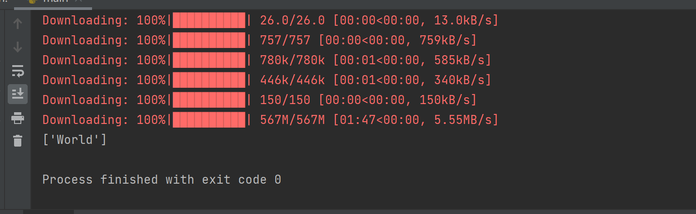

主要内容见论文理解：Data Augmentation with Adversarial Training for Cross-Lingual NLI(note)

借鉴了text2text

下载了facebook的一个多语言翻译模型，能实现100种语言的互相翻译，作为测试。

学习参考了text2text的实现过程。包括基本的分词，向量化，tfidf计算等等。

总的来说只能跑通和使用给的一些函数调用，自己实现还存在困难。

> https://zhuanlan.zhihu.com/p/368226087

